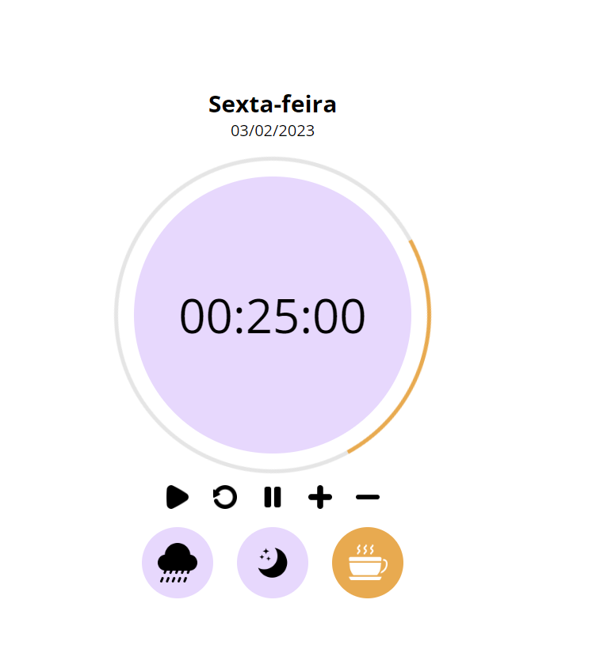

# Time Organization

## ⚙ Status de Execução

Em andamento - No momento sendo trabalhado a listagem

## 📎 Sobre

O projeto consiste na criação de um cronômetro de contagem regressiva para realização de tarefas que podem ser adicionadas em formato de lista, tendo 3 opções de sons de fundo.

## 🛸 Tecnologias Utilizadas

- HTML 5
- CSS 3
- JAVA SCRIPT

## 🖥️ Demonstração

## 🔗 Link da Página

<a href="https://time-to-focus-by-imetzker.netlify.app/" rel="Site" target="_blank">Clique aqui para ir para o projeto em execução</a>

## 👾 Créditos

Desenvolvido por: <a href="https://github.com/iMetzker">Ivny Metzker</a>  

